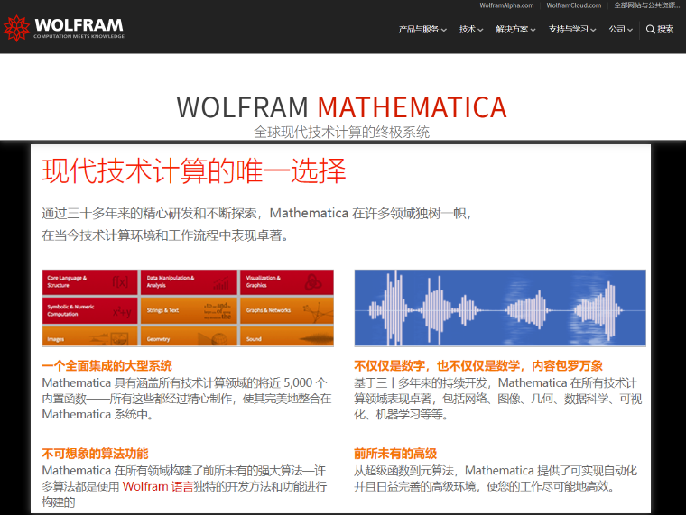

## 简介

这篇paper是2018.01发表在PRL，已经有两篇科普介绍了，链接在这里：

[Machine Learning’s ‘Amazing’ Ability to Predict Chaos](https://www.quantamagazine.org/machine-learnings-amazing-ability-to-predict-chaos-20180418/)

[集智俱乐部 机器学习能否破解混沌？| PRL论文详解](http://wemedia.ifeng.com/63712603/wemedia.shtml)

但这两篇科普介绍，都不详细，尤其是没有公开的源码。所以还是看论文+自己动手实现的是。一篇发在物理顶刊的 AI paper，这对一个坚定的 CS 转行人士来说是非常有吸引力的，可以忽悠老板来获得珍贵的自学时间。


简介部分，上面两篇已经写得很好了，就不赘述了。想跑一遍源码或者深入研究的同学去看 paper 原文吧[PhysRevLett.120.024102](https://journals.aps.org/prl/abstract/10.1103/PhysRevLett.120.024102)，这是最详细的资料。


## 复现思路：

1. 观察过程中的状态
    需要观察的状态有：蓄水池状态r，作为直接输出的x，输入u，预测值y；观察它们的范围，分布，均值，方差。之所以要观察这些过程中的状态有两个好处：
* 有可能找到快速调参的办法，在单次参数测试时不必等待最终结果出来你就能大概率知道这个参数好不好，从而节省资源和时间。
* 观察过程中各种细节各种中间状态，对理解模型有一定帮助。比如，在调参过程中，我已经看到了类似临界的现象的出现，要让蓄水池有混沌动力学行为，还和训练数据背后的模型一样的混沌，很微妙的。嗯，还有了一个关于可视化散点图的idea。这些可能很有用也可能没有用，但是初学者 pandas-like(cs230里吴恩达老师的说法，熊猫精心照顾一个宝宝，沙丁鱼一次性生育千万个宝宝而不照顾) 的方式调参是有很多好处的。


2. 知道怎么调参
一共有哪些参数呢？
矩阵A：尺寸大小，稀疏度，是否厄米，行列式值，非零值的分布，谱半径大小，网络结构
矩阵Win：稀疏度，非零值的分布
训练数据：dx，dt，L，T
不可能遍历所有情况，就算有论文透露出的大致的范围也不行，没有那么多的资源和时间来遍历。

3. 对预测结果解读，反过来改进步骤1，2
具体的，就是依据预测结果，知道下一步最好该做什么，就像这张slide说的：


## 疑问

* 这篇文章有什么意义？为什么能发到PRL上？

    从目前复现的结果看，也不是那么难，那么精妙啊，虽然文章里面故意(大雾)用上了很多纯数名词，比如"谱半径","Erdös-Renyi network","Lyapunov exponent","Kaplan-Yorke dimension",虽然文章在前部分写得很抽象，但这些是可以去掉的，或者说，我仍旧没有理解为什么这样做这样就能预测好几个 Lyapunov time。

    本文的卖点，我想主要在标题中的“大规模时空混沌系统”，也就是文中提到的把多个 reservoirs 并排，增加模型能够处理数据的容量，增加模型的表达能力。这点我还没复现完，不过已经不想再搞下去了。好麻烦的。。

* 嗯，好像就是调参，不断的尝试修改。。。


* 从目前的复现结果看，并非必须要满足原文苛刻的条件(矩阵A)。那么，这种技术应该是很通用的(一个有稀疏随机矩阵/网络就可以做到)，能不能放到具体物理器件上做出效果来？说不定还可以天然抵抗器件缺陷和热噪音哦。

* 能不能这样？
    试了Erdős–Rényi networks 和 Random networks，还有很多呢，要不都去试试，Scale-free networks, Small-world network...

    在空间深度上试试，原文中，单个 reservoir 的尺寸是 5000*5000 这是一个很大的值，tensorflow没有专门针对稀疏矩阵的函数，而且这个矩阵可能也不是非常的稀疏，我测试的时候，A的零元素占比不超过30%。
    5000*5000 实际上是“宽度”的体现，后来并列多个 reservoirs 也是“宽度”的体现，而且改文章用的网络“宽度”实在是太大了。

    那么可不可以，可不可以单个 reservoir 用 300*300 的随机网络，然后在深度上延伸2~3层。已经有文章说明，相比与增加宽度而言，增加深度引起的鞍点和局部最优解要少得多。[link1:paper](https://www.semanticscholar.org/paper/Trivializing-The-Energy-Landscape-Of-Deep-Networks-Chaudhari-Soatto/4a8781c42be9df57e284f7ad471ccf70a25d5d95/pdf), [link2:zhihu](https://zhuanlan.zhihu.com/p/22067439)

    

## 反思与总结：

* 彻底抛弃 mathematica ，所谓开发一时爽，重构火葬场。稍微大一点东西，就不应该用 mma。

    - 一段不是很长的代码，运行很长时间后内存占用就从20%变成99%，然后崩溃。内存管理不好做。

    - 写不了长的程序，变量名默认就是全局，写时是爽了，修改的时候，尤其是一个notebook打开24h后，你再修改的时候根本不记得变量名，这进一步增加内存管理的不便。mma 当然有包管理，还有上下文，但总觉得没python/cpp舒服，再说了，我很想问一下有多少mma用户会用包管理和上下文，mma本身就鼓励写简短的代码鼓励只在一页纸解决问题，这进一步导致很多用户不会用。

    - mma适合做什么呢？适合做听课笔记这一量级的东西，运行时间不超过2h，代码量不超过200行；也适合写个草稿来对 idea 做个最基本的验证；适合做一些解析推导，数值求解微分方程，这类专业的数学方面的东西。

    - 我现在感觉 mma 官网得宣传有些尬吹，比如“全球现代技术计算的终极系统”，“现代技术计算的唯一选择”。

      


* 吴恩达讲的课，尽管没有直接讲 reservoir computing ，但依然已经很有用了，是那么回事。

* 复现一篇 paper 实在是有些太浪费时间，关键是作者们基本都不回邮件，发paper时也几乎都不会附带源码。

* 一定要早点洗白身份，洗白，赴往CS和AI的海洋！！！

## 数据&源码
[https://github.com/bluove/paper-reproduction/tree/master/2018-Phys.Rev.Lett.120.024102](https://github.com/bluove/paper-reproduction/tree/master/2018-Phys.Rev.Lett.120.024102)

数据太大，不便放在github，数据下载：[https://www.jianguoyun.com/p/Dfy52f4Q4uWRBxiRh30](https://www.jianguoyun.com/p/Dfy52f4Q4uWRBxiRh30)

欢迎 start。下载，然后

```python
# 关于数据，想复现的话需要安装mathematica，再运行.nb文件。
# 运行.py文件需要python3.6及以后版本，需要numpy。
cd cache0929
ipython 000.py
```

就可以了。在某个小范围扫描参数的结果已经打包在里面了。

需要说明的是，原文的误差曲线非常光滑，这是因为用了10个不同的蓄水池来画误差曲线。

> The rms error is averaged over the K independent predictions to give an estimate of the typical quality of prediction. We perform the same prediction 10 times, for different random reservoir realizations, and calculate the average root-mean-square error (RMSE) over all the trials.

我测试了两个不同的蓄水池，都能预测到9个 Lyapunov time，加上蓄水池是随机生成的矩阵，所以用10个不同的蓄水池应该也都能预测9个 Lyapunov time ，再平均一下误差曲线就光滑了。

还有一个细节是，同样地数据的code，在不同的电脑上，结果会有些差异，我在两台电脑上测试过了，可能是32位/64位的差别，或者是别的什么。如果某个时间点有10e-30精度的误差，经过足够长时间后(t>1000)可能就有很可观的差异了，毕竟是混沌系统，最大 Lyapunov exponent 为0.1。

关于计算精度，以及它带来的影响，这已经超过我的能力范围。不过不用太过担心，虽然不同的电脑，不同的解释器/编译器，可能结果不一样。但有一点确定，在两种不同的环境用两个不同的蓄水池都能预测 9 个 Lyapunov time。实际上不同的环境不同的蓄水池都能在某个小范围内找到最好参数的。

-A1Win1-reinit95000-dev1count=900.jpg)

有些细节和原文不一样，比如单个蓄水池尺寸我用的是2000*2000，稀疏度肯定和原文也不一样，等等。上图，中间的图是理论值，顶部是预测值，底部是误差曲线。dt=0.1，Lyapunov exponent=0.1，所以大约预测了9个 Lyapunov time。


---
实际上，单个 reservoir 预测的话，不一定要 5000 * 5000 或 2000 * 2000这么宽。在我复现的过程中，有一次只用500*500的reservoir就预测了6个 Lyapunov time，这可以和论文中 Fig.2 相比。

最后，code 很烂，勉强“能跑起来”的水平，应该重构，重构，重构，，，但是已经不太想搞这篇了。


